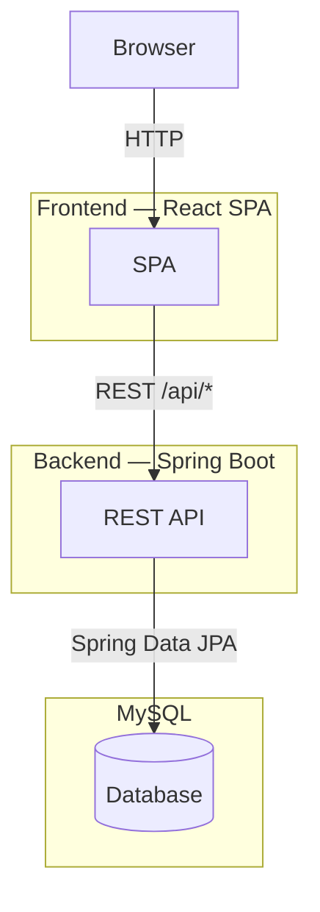

# Internship Management System — Architecture Diagrams

## High-Level Overview

---

## Detailed Diagrams

| Document | Description |
|----------|-------------|
| [Frontend Architecture](frontend-architecture.md) | React feature modules, routing, API client layer, shared components |
| [Backend Architecture](backend-architecture.md) | Security, controller, service, and repository layers |
| [Database Schema](database-schema.md) | ER diagram and column definitions |
| [Workflows](workflows.md) | Authentication, job application, and student registration sequence diagrams |
