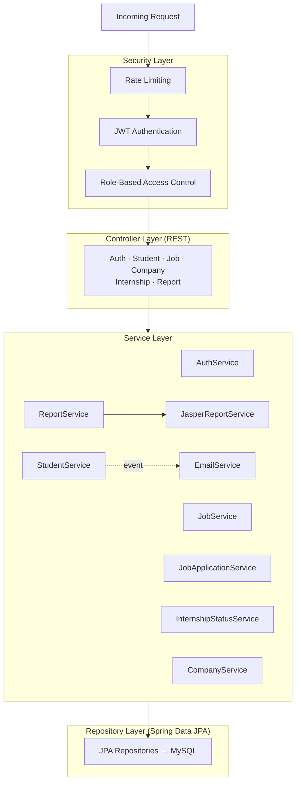

# Backend Architecture — Spring Boot

## Layered Architecture

```mermaid
graph TB
    Request["Incoming Request"]

    subgraph Security["Security Layer"]
        RateLimit["Rate Limiting"]
        JWTAuth["JWT Authentication"]
        RBAC["Role-Based Access Control"]
    end

    subgraph Controllers["Controller Layer (REST)"]
        Controllers_node["Auth · Student · Job · Company<br/>Internship · Report"]
    end

    subgraph Services["Service Layer"]
        SvcAuth["AuthService"]
        SvcStudent["StudentService"]
        SvcJob["JobService"]
        SvcJobApp["JobApplicationService"]
        SvcIntern["InternshipStatusService"]
        SvcCompany["CompanyService"]
        SvcReport["ReportService"]
        SvcJasper["JasperReportService"]
        SvcEmail["EmailService"]
    end

    subgraph Repositories["Repository Layer (Spring Data JPA)"]
        Repos_node["JPA Repositories → MySQL"]
    end

    Request --> RateLimit --> JWTAuth --> RBAC
    RBAC --> Controllers_node
    Controllers_node --> Services
    SvcReport --> SvcJasper
    SvcStudent -.->|"event"| SvcEmail
    Services --> Repos_node
```
