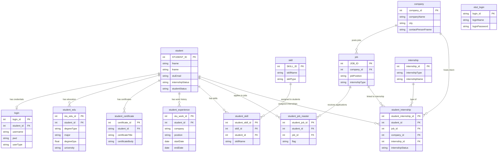

# Database Schema — MySQL 8.4

## Tables & Relationships

```mermaid
erDiagram
    student ||--o| login : "has credentials"
    student ||--o{ student_edu : "has education"
    student ||--o{ student_certificate : "has certificates"
    student ||--o{ student_experience : "has work history"
    student ||--o{ student_skill : "has skills"
    student ||--o{ student_job_master : "applies to jobs"
    student ||--o{ student_internship : "assigned internships"

    skill ||--o{ student_skill : "assigned to students"

    company ||--o{ job : "posts jobs"

    job ||--o{ student_job_master : "receives applications"
    job ||--o{ student_internship : "linked to internship"

    company ||--o{ student_internship : "hosts intern"
    internship ||--o{ student_internship : "type of"

    student {
        int STUDENT_ID PK
        string fname
        string lname
        string stuEmail
        string internshipStatus
        string studentStatus
    }
    company {
        int company_id PK
        string companyName
        string city
        string contactPersonFname
    }
    job {
        int JOB_ID PK
        int company_id FK
        string jobPosition
        string internshipType
    }
    login {
        int login_id PK
        int student_id FK
        string username
        string pwd
        string userType
    }
    vbct_login {
        string login_id PK
        string loginName
        string loginPassword
    }
    skill {
        int SKILL_ID PK
        string skillName
        string skillType
    }
    internship {
        int internship_id PK
        string internshipType
        string internshipName
    }
    student_job_master {
        int student_job_id PK
        int student_id FK
        int job_id FK
        string flag
    }
    student_internship {
        int student_internship_id PK
        int student_id FK
        int job_id FK
        int company_id FK
        int internship_id FK
        string internshipStatus
    }
    student_edu {
        int stu_edu_id PK
        int student_id FK
        string degreeType
        string major
        float degreeGpa
        string university
    }
    student_certificate {
        int certificate_id PK
        string student_id FK
        string certificateTitle
        string certificateBody
    }
    student_experience {
        int stu_work_id PK
        int student_id FK
        string company
        string position
        date startDate
        date endDate
    }
    student_skill {
        int student_skill_id PK
        int skill_id FK
        int student_id FK
        string skillName
    }
```
