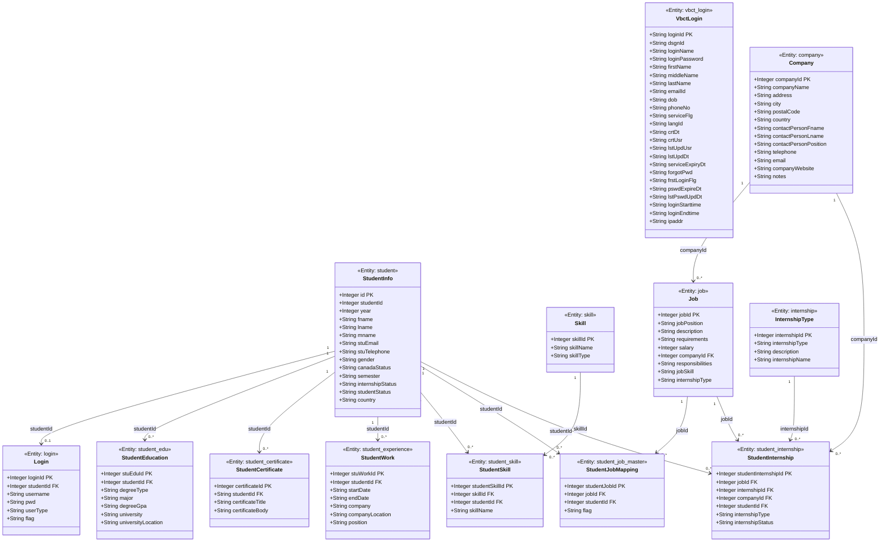
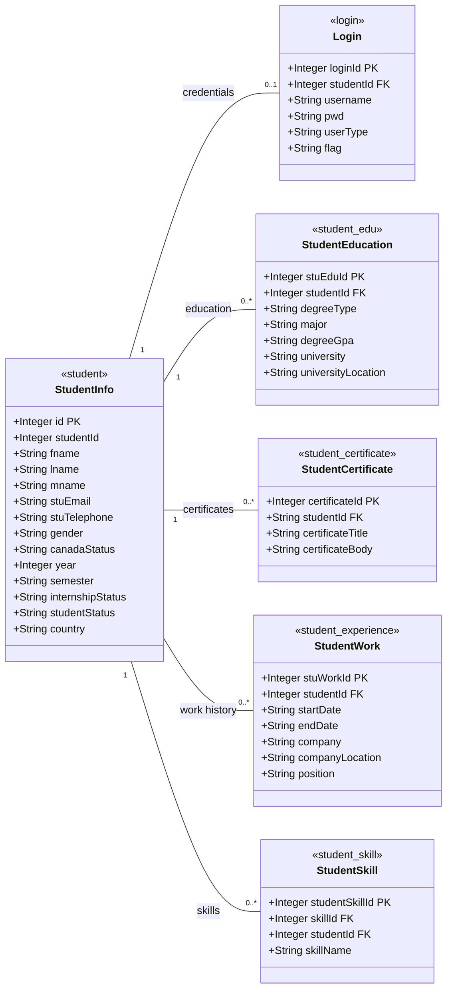
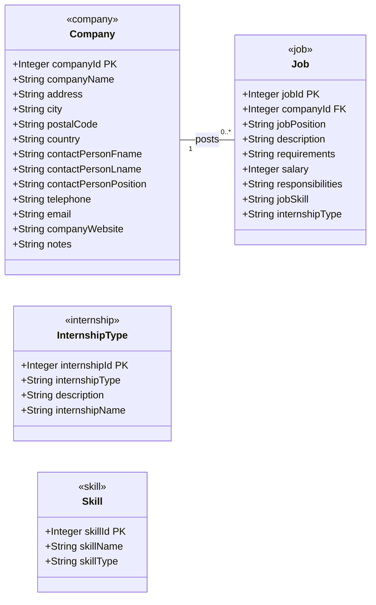
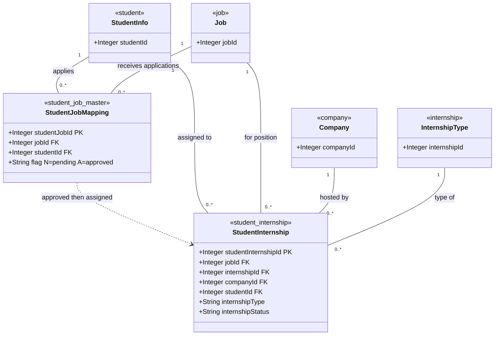
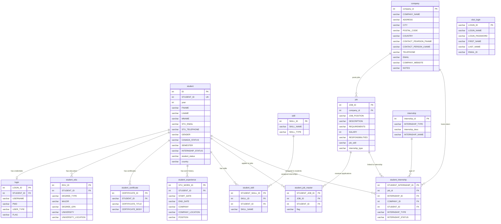

# Database / Entity UML Diagrams

## 1. Complete Entity Class Diagram

---

## 2. Student Domain (Zoomed In)

---

## 3. Company & Job Domain (Zoomed In)

---

## 4. Junction / Mapping Tables (Zoomed In)

---

## 5. ER Diagram (Database-Level View)

