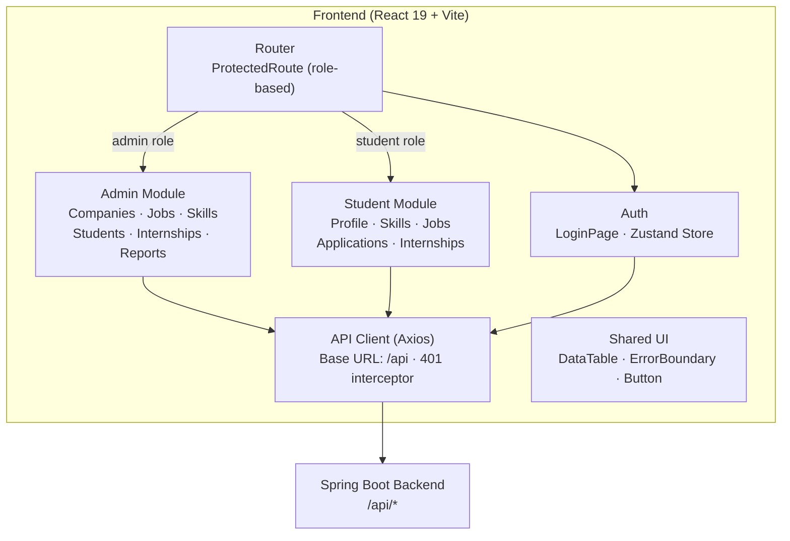

# Frontend Architecture — React 19 + Vite + Tailwind v4

## High-Level Overview

```mermaid
graph TB
    subgraph Frontend["Frontend (React 19 + Vite)"]
        Routing["Router<br/>ProtectedRoute (role-based)"]

        Auth["Auth<br/>LoginPage · Zustand Store"]

        Admin["Admin Module<br/>Companies · Jobs · Skills<br/>Students · Internships · Reports"]

        Student["Student Module<br/>Profile · Skills · Jobs<br/>Applications · Internships"]

        API["API Client (Axios)<br/>Base URL: /api · 401 interceptor"]

        UI["Shared UI<br/>DataTable · ErrorBoundary · Button"]
    end

    Backend["Spring Boot Backend<br/>/api/*"]

    Routing --> Auth
    Routing -->|admin role| Admin
    Routing -->|student role| Student
    Admin --> API
    Student --> API
    Auth --> API
    API --> Backend
```
