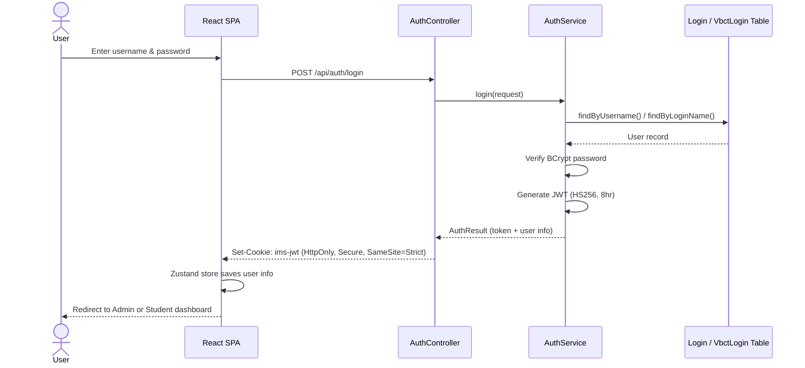
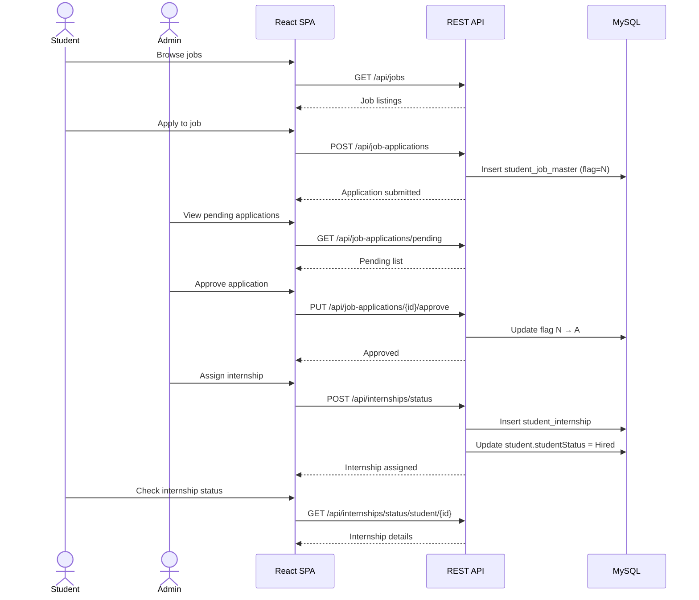
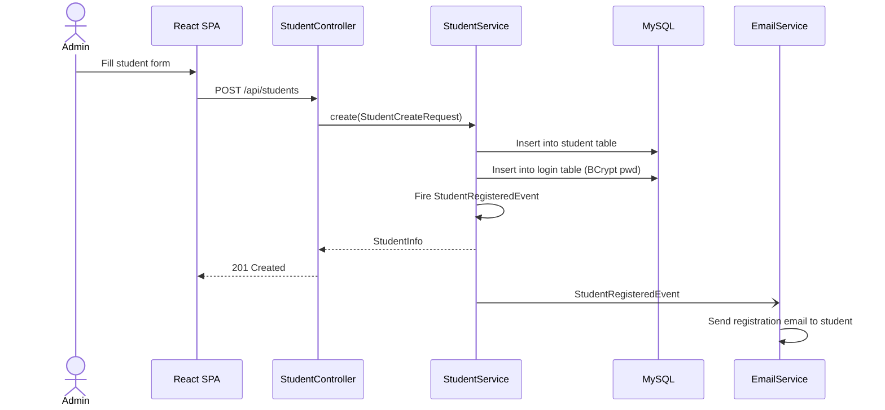

# Key Workflows

## Authentication Flow

```mermaid
sequenceDiagram
    actor User
    participant FE as React SPA
    participant Auth as AuthController
    participant Svc as AuthService
    participant DB as Login / VbctLogin Table

    User->>FE: Enter username & password
    FE->>Auth: POST /api/auth/login
    Auth->>Svc: login(request)
    Svc->>DB: findByUsername() / findByLoginName()
    DB-->>Svc: User record
    Svc->>Svc: Verify BCrypt password
    Svc->>Svc: Generate JWT (HS256, 8hr)
    Svc-->>Auth: AuthResult (token + user info)
    Auth-->>FE: Set-Cookie: ims-jwt (HttpOnly, Secure, SameSite=Strict)
    FE->>FE: Zustand store saves user info
    FE-->>User: Redirect to Admin or Student dashboard
```

## Job Application → Internship Assignment

```mermaid
sequenceDiagram
    actor Student
    actor Admin
    participant FE as React SPA
    participant API as REST API
    participant DB as MySQL

    Student->>FE: Browse jobs
    FE->>API: GET /api/jobs
    API-->>FE: Job listings

    Student->>FE: Apply to job
    FE->>API: POST /api/job-applications
    API->>DB: Insert student_job_master (flag=N)
    API-->>FE: Application submitted

    Admin->>FE: View pending applications
    FE->>API: GET /api/job-applications/pending
    API-->>FE: Pending list

    Admin->>FE: Approve application
    FE->>API: PUT /api/job-applications/{id}/approve
    API->>DB: Update flag N → A
    API-->>FE: Approved

    Admin->>FE: Assign internship
    FE->>API: POST /api/internships/status
    API->>DB: Insert student_internship
    API->>DB: Update student.studentStatus = Hired
    API-->>FE: Internship assigned

    Student->>FE: Check internship status
    FE->>API: GET /api/internships/status/student/{id}
    API-->>FE: Internship details
```

## Student Registration

```mermaid
sequenceDiagram
    actor Admin
    participant FE as React SPA
    participant API as StudentController
    participant Svc as StudentService
    participant DB as MySQL
    participant Email as EmailService

    Admin->>FE: Fill student form
    FE->>API: POST /api/students
    API->>Svc: create(StudentCreateRequest)
    Svc->>DB: Insert into student table
    Svc->>DB: Insert into login table (BCrypt pwd)
    Svc->>Svc: Fire StudentRegisteredEvent
    Svc-->>API: StudentInfo
    API-->>FE: 201 Created

    Svc-)Email: StudentRegisteredEvent
    Email->>Email: Send registration email to student
```
